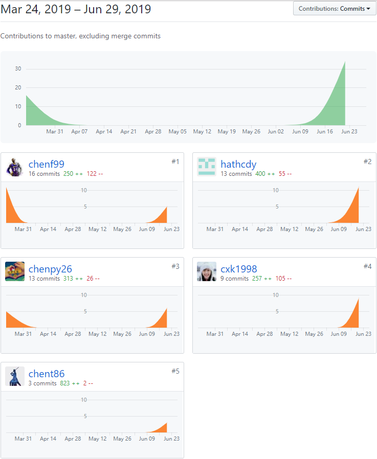

# 个人小结

## 简短总结

在课程项目中我主要担任的是UI设计师和产品经理。

我在项目中完成的工作有如下几项：

### 设计

- 使用Adobe XD进行UI界面的设计
- 设计用例

### 文档

- 参与需求规格说明书的编写
- 编写数据库文档
- 编写架构设计、详细设计（BCE方法）到应用框架映射指南

## PSP2.1统计

|                                       | Personal Software Process Stages         | Time (%) |
| ------------------------------------- | ---------------------------------------- | -------- |
| **Planning**                          | **计划**                                 | **10**   |
| estimate                              | 预估任务时间                             | 10       |
| **Development**                       | **开发**                                 | 80       |
| analysis                              | 需求分析                                 | 10       |
| design spec                           | 生成设计文档                             | 18       |
| estimate                              | 设计复审（与前端团队成员审核设计文档）   | 5        |
| coding standard                       | 代码规范                                 | 2        |
| design                                | 具体设计，包括绘制 UI，设计架构等        | 25       |
| coding                                | 具体编码                                 | 10       |
| code review                           | 代码复审                                 | 5        |
| test                                  | 测试（修改代码）                         | 5        |
| **Report**                            | **报告**                                 | 10       |
| test report                           | 测试报告                                 | 3        |
| size measurement                      | 计算工作量                               | 3        |
| postmortem & process improvement plan | 每次会议确认任务完成进度，并制定进度计划 | 4        |

## 最得意/或有价值/或有苦劳的工作清单

### 最得意

设计UI，效果还挺让自己满意的。

### 最有苦劳

相比前、后端成员的工作量，我只是做了一些微小的贡献。

## 项目贡献

图中`hathcdy`是我的帐号

## 个人博客

[从系分课程项目中学到的IT项目管理知识](<https://blog.csdn.net/hath_cdy/article/details/94131819> )

## 特别致谢

[chent86](https://github.com/orgs/haowe-7/people/chent86)：后端负责人，完成后端的搭建，设计API。

[chenpy26](https://github.com/orgs/haowe-7/people/chenpy26)：PM，合作进行UI设计和撰写文档。

[chensm9](https://github.com/orgs/haowe-7/people/chensm9)：前端负责人，将UI设计转化为可用的产品。

以及其他团队成员，项目的完成大家都功不可没。