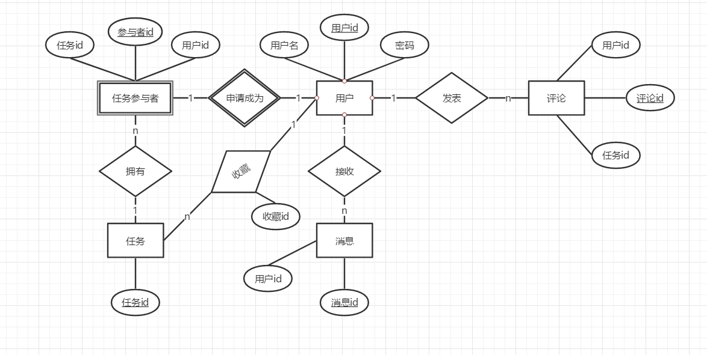

# 数据库设计

## 1. 数据库划分

### 用户数据

- 用户基本信息（用户名、头像、电话）
- 扩展信息（余额）

### 任务数据

- 任务基本信息（标题、类型、报酬、时间）
- 扩展信息（图片、最大参与人数）

### 评论系统

- 对应任务
- 评论内容

### 消息系统

- 对应用户
- 消息内容

### 接受任务

- 用户申请成为任务参与者
- 每个任务有参与者列表

## 2. ER模型

## 3. 关系模型

- 用户 - 评论：1对N
  - 用户（**用户id**，用户名，密码）
  - 评论（**评论id**，用户id， 任务id）
- 用户 - 任务参与者：1对1
  - 用户（**用户id**，用户名，密码）
  - 参与者（**参与者id**，用户id，任务id）
- 用户 - 消息：1对N
  - 用户（**用户id**，用户名，密码）
  - 消息（**消息id**，用户id）
- 任务参与者 - 任务
  - 参与者（**参与者id**，用户id，任务id）
  - 任务（**任务id**）

## 4. 物理模型

- **User**

|   Field    |    Type     | Key  | Description |
| :--------: | :---------: | :--: | :---------: |
|  user_id   |     int     | PRI  |   用户id    |
| student_id | varchar(10) |      |    学号     |
|  username  | varchar(20) |      |   用户名    |
|  password  | varchar(40) |      |    密码     |
|   major    | varchar(20) |      |    专业     |
|   email    | varchar(30) |      |  电子邮箱   |
|   phone    | varchar(20) |      |    电话     |
|   avator   |   binary    |      |    头像     |
|  balance   |     int     |      |    余额     |

- **Task**

|      Field      |    Type     | Key  |    Description     |
| :-------------: | :---------: | :--: | :----------------: |
|     task_id     |     int     | PRI  |       任务id       |
|   creator_id    |     int     |      |      创建者id      |
|      title      | varchar(20) |      |        标题        |
|    task_type    |     int     |      |      任务类型      |
|     reward      |     int     |      |      任务报酬      |
|   description   |    text     |      |      任务描述      |
|    due_time     |  datetime   |      |      截止时间      |
| max_participate |     int     |      |   最大参与者数量   |
|      extra      |    text     |      | 任务内容，json格式 |
|      image      |   binary    |      |      任务图片      |

- **Comment**

|   Field    |     Type     | Key  | Description |
| :--------: | :----------: | :--: | :---------: |
| comment_id |     int      | PRI  |   评论id    |
|  user_id   |     int      |      |   用户id    |
|  task_id   |     int      |      |   任务id    |
|  content   | varchar(100) |      |  评论内容   |

- **Collect**

|   Field    | Type | Key  | Description |
| :--------: | :--: | :--: | :---------: |
| collect_id | int  | PRI  |   收藏id    |
|  user_id   | int  |      |   用户id    |
|  task_id   | int  |      |   任务id    |

- **Participate** 

|     Field      | Type | Key  | Description |
| :------------: | :--: | :--: | :---------: |
| participate_id | int  | PRI  |  参与者id   |
|    user_id     | int  |      |   用户id    |
|    task_id     | int  |      |   任务id    |
|     status     | int  |      | 参与者状态  |

- **Message**

|   Field    |     Type     | Key  | Description |
| :--------: | :----------: | :--: | :---------: |
| message_id |     int      | PRI  |   消息id    |
|  user_id   |     int      |      |   用户id    |
|  content   | varchar(100) |      |  消息内容   |

- **Submission**

|     Field     | Type | Key  |    Description     |
| :-----------: | :--: | :--: | :----------------: |
| submission_id | int  | PRI  |       消息id       |
|    user_id    | int  |      |       用户id       |
|    task_id    | int  |      |       任务id       |
|    answer     | text |      | 问卷答案，json格式 |