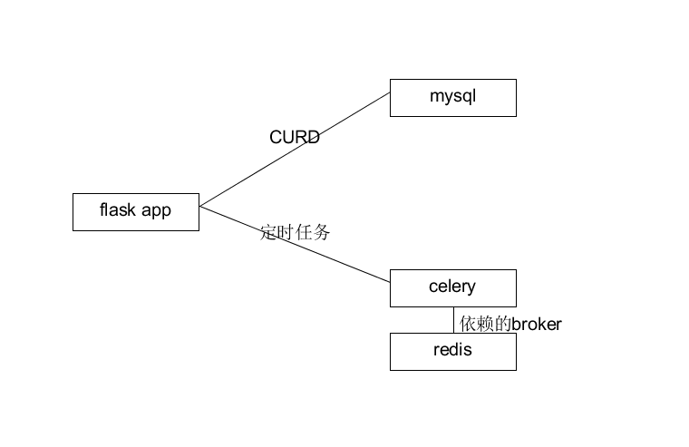
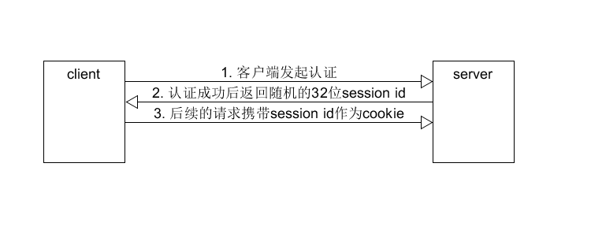

# 软件设计文档

## 后端

### 技术选型理由
> Python Flask框架
- 官方文档详细，学习成本低，有利于项目其他成员迅速投入开发
- 框架轻，可扩展性高，且有很多好用的扩展(extension)
- 该框架仍在积极地维护和开发
- 使用Python, 有很多好用的库，写起来很舒服，项目成员也对Python比较熟悉

### 架构设计

> 容器

使用docker进行部署，构建脚本见docker-compose.yml，分为四个容器
- Flask app容器, 后端主体逻辑部分
- mysql容器, 数据库
- celery容器, 负责执行定时任务
- redis容器, 作为celery的broker



> 路由

使用flask_blueprint进行资源型路由，使用flask_restful进行特定api的路由。因为资源型路由的增加、修改、删除并不能完全满足api的需求，所以需要特定路由来进行补充。
在app层对路由进行注册
```python
def setup(app):
    api = Api(app)
    app.register_blueprint(user_blueprint, url_prefix='/users')
    app.register_blueprint(auth_blueprint)
    app.register_blueprint(task_blueprint, url_prefix='/tasks')
    app.register_blueprint(participate_blueprint, url_prefix='/participates')
    app.register_blueprint(comment_blueprint, url_prefix='/comments/')

    api.add_resource(UserResource, '/users/')
    api.add_resource(TaskResource, '/tasks/')
    api.add_resource(CommentResource, '/comments/')
    api.add_resource(ParticipateResource, '/participates/')
    api.add_resource(CollectResource, '/collects/')
    api.add_resource(MessageResource, '/messages/')
    api.add_resource(SubmissionResource, '/submissions/')
```


### 模块划分
- 鉴权模块 auth
【cookie+session认证】

认证成功后，服务端随机生成32位字符串作为session id，并与认证的用户id一并存储在内存中(后续考虑存储在redis中)，并返回session id给客户端。之后客户端的请求携带的cookie的值为session id，匹配到的用户id就是发起该请求的用户，若无匹配的项则为无权限的请求，返回403。

> 登录

用户密码使用md5进行加密后存储到数据库，认证成功后，random_helper函数返回随机生成的32位字符串作为session id, 并进行session[session_id] = user.id操作存储session内存。resp.set_cookie('fat-wallet', session_id, max_age=300)设置返回的cookie头部，并设置cookie的超时时间。
```python
@blueprint.route('/login', methods=['POST'])
def login():
    if auth_helper():
        return 'already login', 200
    form = request.get_json(True, True)
    username = form.get("username")
    password = form.get("password")
    pass_md5 = hashlib.md5(password.encode(encoding='UTF-8')).hexdigest()
    user = User.get(username=username)
    if not user:
        return jsonify(error='该用户不存在'), 400
    user = user[0]
    if user.password != pass_md5:
        return jsonify(error='密码错误'), 400
    resp = make_response()
    resp.status_code = 200
    data = dict(user_id=user.id, student_id=user.student_id,
                username=user.username, major=user.major,
                email=user.email, phone=user.phone,
                avatar=user.avatar.decode() if user.avatar else None)
    resp.response = json.dumps(data)
    session_id = random_helper()
    resp.set_cookie('fat-wallet', session_id, max_age=300)
    session[session_id] = user.id
    return resp
```
> 在app层进行鉴权

除了登录和注册的请求，其他请求都要求携带cookie。后端将检测cookie是否合法(为已登录的用户的session id)，如果非法则返回403.
```python
valid_path = {'/login', '/users/'}
@app.before_request
def before_request():
    session_id = request.cookies.get('fat-wallet')
    valid = session.get(session_id, None)
    if request.path not in valid_path and not valid:
        logging.error("invalid request is caught")
        return jsonify(error='您还没有登录'), 403  # 不能用dict
    if not valid and request.path == '/users/' and request.method != 'POST':
        return jsonify(error='您还没有登录'), 403
```
> 根据cookie就可以判断用户的id
```python
def auth_helper():
    session_id = request.cookies.get('fat-wallet')
    if session_id:
        user_id = session.get(session_id)
        return user_id
```
- 用户模块 user
> 获取用户信息

接受可选的参数进行筛选，如根据学号，用户名或者offset+limit进行批量分页获取
```python
class UserResource(Resource):
    def get(self):
        student_id = request.args.get("student_id")
        username = request.args.get("username")
        offset = request.args.get("offset")
        limit = request.args.get("limit")
        users = User.get(student_id=student_id, username=username, offset=offset, limit=limit)
        result = [{"user_id": user.id, "student_id": user.student_id,
                   "username": user.username, "major": user.major,
                   "email": user.email, "phone": user.phone,
                   "nickname": user.nickname, "profile": user.profile,
                   "balance": user.balance,
                   "avatar": user.avatar.decode() if user.avatar else None} for user in users]
        return dict(data=result, count=len(result)), 200
```
> 注册

若用户名或其他不可重复的字段已被使用，则捕获数据库的异常，返回错误信息
```python
    def post(self):
        form = request.get_json(True, True)
        username = form.get('username')
        if not username:
            return dict(error='用户名不能为空'), 400
        password = form.get('password')
        if not password:
            return dict(error='密码不能为空'), 400
        email = form.get('email')
        pass_md5 = encrypt_helper(password)
        try:
            user = User(username=username, password=pass_md5, email=email)
            db.session.add(user)
            db.session.commit()
        except exc.IntegrityError as e:
            if re.search(r"Duplicate entry '\S*' for key '\S*'", e.orig.args[1]):
                logging.error(f"create user failed, msg: {e}")
                column = re.findall(r"'\S*'", e.orig.args[1])[1].strip("'")
                return dict(error=f"该{user_column_cn[column]}已被使用"), 400
        return dict(data='register success!'), 200
```
> 修改个人信息

此api不包括用户名和密码的修改。如果修改的
```python
    def patch(self):  # 不涉及username,password的修改
        form = request.get_json(True, True)
        user_id = auth_helper()
        if not form:
            return dict(error="表单不能为空"), 400
        student_id = form.get("student_id")
        email = form.get("email")
        major = form.get("major")
        phone = form.get("phone")
        nickname = form.get('nickname')
        profile = form.get('profile')
        balance = form.get('balance')
        avatar = form.get("avatar")

        try:
            User.patch(user_id=user_id, student_id=student_id,
                       email=email, major=major, phone=phone,
                       nickname=nickname, profile=profile, balance=balance,
                       avatar=avatar.encode('utf-8') if avatar else None)
        except exc.IntegrityError as e:
            if re.search(r"Duplicate entry '\S*' for key '\S*'", e.orig.args[1]):
                logging.error(f"patch user failed, msg: {e}")
                column = re.findall(r"'\S*'", e.orig.args[1])[1].strip("'")
                return dict(error=f"该{user_column_cn[column]}已被使用"), 400
        return dict(data='ok'), 200
```
> 修改密码

```python
@blueprint.route('/password', methods=['PUT'])
def update_password():
    form = request.get_json(True, True)
    user_id = auth_helper()
    new_pass = form.get("password")
    if not new_pass:
        return jsonify(error="密码不能为空"), 400
    new_pass = encrypt_helper(new_pass)
    User.patch(user_id=user_id, password=new_pass)
    cookie = request.cookies
    session_id = cookie.get('fat-wallet')
    session.pop(session_id)
    return jsonify(data="ok"), 200
```
- 任务模块 task
> 获取任务相关信息

同时返回任务参与者、任务是否已收藏、任务的评论数量等综合信息，简化前端获取数据的流程
```python
    def get(self):
        creator_id = request.args.get("creator_id")
        title = request.args.get('title')
        task_type = request.args.get("task_type")
        min_reward = request.args.get("min_reward")
        max_reward = request.args.get("max_reward")
        offset = request.args.get("offset")
        limit = request.args.get("limit")
        tasks = Task.get(creator_id=creator_id, title=title, task_type=task_type,
                         min_reward=min_reward, max_reward=max_reward,
                         offset=offset, limit=limit)
        result = [{"task_id": task.id, "title": task.title, "task_type": task.task_type,
                   "reward": task.reward, "description": task.description,
                   "due_time": task.due_time.strftime("%Y-%m-%d %H:%M"),
                   "max_participate": task.max_participate, "creator_id": task.creator_id,
                   "image": task.image.decode() if task.image else None} for task in tasks]

        for value in result:
            creator = User.get(value["creator_id"])[0]
            value["creator_name"] = creator.username
            participators = [{"user_id": p.user_id, "status": ParticipateStatusCN[p.status]}
                             for p in Participate.get(task_id=value["task_id"])]
            for p in participators:
                user = User.get(user_id=p["user_id"])[0]
                p["username"] = user.username
            value["participators"] = participators
            user_id = auth_helper()
            collect = Collect.get(user_id=user_id, task_id=value['task_id'])
            value['is_collect'] = True if collect else False    # 是否收藏该任务
            comments = Comment.get(task_id=value['task_id'])
            value['num_comments'] = len(comments) if comments else 0    # 任务的评论数
        return dict(data=result, count=len(result)), 200
```
> 创建并发布任务

```python
    def post(self):
        creator_id = auth_helper()
        form = request.get_json(True, True)
        title = form.get('title')
        if not title:
            return dict(error='任务标题不能为空'), 400
        task_type = form.get('task_type')
        if not task_type:
            return dict(error='任务类型不能为空'), 400
        reward = form.get('reward')
        if not reward:
            return dict(error='赏金不能为空'), 400
        description = form.get('description')
        if not description:
            return dict(error='任务描述不能为空'), 400
        due_time = form.get('due_time')
        if not due_time:
            return dict(error='任务截止时间不能为空'), 400
        if due_time < get_cur_time():
            return dict(error='任务结束时间已过'), 400
        max_participate = form.get('max_participate')
        if not max_participate:
            return dict(error='任务人数上限不能为空'), 400
        extra = form.get('extra')
        try:
            extra = json.dumps(extra)
        except Exception:
            return dict(error='请指定正确的任务内容'), 400
        image = form.get('image')
        task = Task(creator_id=creator_id, task_type=task_type, reward=reward,
                    description=description, due_time=due_time,
                    max_participate=max_participate, extra=extra, image=image)
        db.session.add(task)
        db.session.commit()
        return dict(data="ok"), 200
```
> 修改任务信息

```python
    def patch(self):
        form = request.get_json(True, True)
        user_id = auth_helper()
        if not form:
            return dict(error="表单不能为空"), 400
        task_id = form.get("task_id")
        if not task_id:
            return dict(error="任务ID不能为空"), 400
        task = Task.get(task_id=task_id)
        if not task:
            return dict(error="该任务不存在"), 400
        task = task[0]
        if task.creator_id != user_id:
            return dict(error="权限不足"), 403
        participates = Participate.get(task_id=task_id)
        if participates:
            # 有用户已经开始做任务/完成任务时无法修改
            for participate in participates:
                if participate.status != ParticipateStatus.APPLYING.value:
                    return dict(error='任务已经有人参与，无法修改'), 400
            # 通知所有申请该任务的用户: 该任务已修改
            for participate in participates:
                message = Message(user_id=participate.user_id, content=f'您申请参与的任务"{task.title}"有改动的信息')
                db.session.add(message)
                db.session.commit()
        title = form.get('title')
        task_type = form.get('task_type')
        reward = form.get('reward')
        description = form.get('description')
        start_time = form.get('start_time')
        due_time = form.get('due_time')
        max_participate = form.get('max_participate')
        extra = form.get('extra')
        try:
            extra = json.dumps(extra)
        except Exception:
            return dict(error='请指定正确的任务内容'), 400
        image = form.get('image')
        Task.patch(task_id=task_id, title=title, task_type=task_type, reward=reward,
                   description=description, start_time=start_time, due_time=due_time,
                   max_participate=max_participate, extra=extra, image=image)
        return dict(data='修改任务成功'), 200
```
> 取消任务

```python
    def delete(self):
        form = request.get_json(True, True)
        user_id = auth_helper()
        task_id = form.get("task_id")
        if not task_id:
            return jsonify(error='任务ID不能为空'), 400
        task = Task.get(task_id=task_id)
        if not task:
            return jsonify(error='该任务不存在'), 400
        task = task[0]
        if task.creator_id != user_id:
            return jsonify(error='权限不足'), 403
        participates = Participate.get(task_id=task_id)
        if participates:
            # 有用户已经开始做任务/完成任务时无法取消
            for participate in participates:
                if participate.status != ParticipateStatus.APPLYING.value:
                    return dict(error='任务已经有人参与，无法取消'), 400
            # 通知所有申请该任务的用户: 该任务已取消
            for participate in participates:
                message = Message(user_id=participate.user_id, content=f'您申请参与的任务"{task.title}"已取消')
                db.session.add(message)
                db.session.commit()
            # 数据库外键约束，删除任务自动删除所有participate
            # db.session.delete(participates)
            # db.session.commit()
        db.session.delete(task)
        db.session.commit()
        return dict(data='取消任务成功'), 200
```
> 获取具体的任务信息,如问卷内容、快递单号

```python
@blueprint.route('/extra', methods=['GET'])
def get_extra():    # 获取任务的具体内容，仅甲方和通过申请的乙方可查看
    user_id = auth_helper()
    task_id = request.args.get("task_id")
    if not task_id:
        return jsonify(error='请指定任务'), 400
    task = Task.get(task_id=task_id)
    if not task:
        return jsonify(error='任务不存在'), 400
    task = task[0]
    participate = Participate.get(user_id=user_id, task_id=task_id)
    # 未参与、申请中、非创建者
    if (not participate or (participate and participate[0].status == ParticipateStatus.APPLYING.value))\
            and task.creator_id != user_id:
        return jsonify(error='没有权限查看'), 403
    return jsonify(data=json.loads(task.extra)), 200
```

> 甲方验收乙方的任务完成情况

```python
@blueprint.route('/review', methods=['POST'])
def review_task():  # 甲方审核乙方的任务完成结果
    creator_id = auth_helper()
    form = request.get_json(True, True)
    participator_id = form.get('participator_id')
    view = form.get('view')
    task_id = form.get('task_id')
    if not participator_id:
        return jsonify(error='请指定任务参与者'), 400
    if not task_id:
        return jsonify(error='请指定任务'), 400
    task = Task.get(task_id=task_id)
    if not task:
        return jsonify(error='任务不存在'), 400
    task = task[0]
    if task.creator_id != creator_id:
        return jsonify(error='没有操作权限'), 403
    participate = Participate.get(user_id=participator_id, task_id=task_id)
    if not participate:
        return jsonify(error='用户未参与此任务'), 400
    participate = participate[0]
    if participate.status != ParticipateStatus.FINISH.value:
        return jsonify(error='用户未完成此任务'), 400
    if not view or (view != 'yes' and view != 'no'):
        return jsonify(error='请指定正确的审核结果'), 400
    if view == 'yes':   # 甲方满意，审核通过
        # 发消息告知乙方
        message = Message(user_id=participator_id,
                          content=f'您参与的任务{task.title}完成情况通过审核，赏金和押金将送至您的账户')
        db.session.add(message)
        db.session.commit()
    else:   # 甲方不满意，审核不通过
        # 发消息告知乙方
        message = Message(user_id=participator_id,
                          content=f'您参与的任务{task.title}完成情况未通过审核，暂时无法获得赏金和押金')
        db.session.add(message)
        db.session.commit()
    return jsonify(data='审核完成'), 200
```

> 乙方对验收情况表态, 如果不同当前的验收，将由管理员介入协调

```python
@blueprint.route('/appeal', methods=['POST'])
def appeal_task():  # 乙方(是否)申诉甲方的审核结果
    user_id = auth_helper()
    form = request.get_json(True, True)
    task_id = form.get('task_id')
    view = form.get('view')
    if not task_id:
        return jsonify(error='请指定任务'), 400
    task = Task.get(task_id=task_id)
    if not task:
        return jsonify(error='任务不存在'), 400
    task = task[0]
    if not view or (view != 'yes' and view != 'no'):
        return jsonify(error='请指定正确的申诉请求'), 400
    participate = Participate.get(user_id=user_id, task_id=task_id)
    if not participate:
        return jsonify(error='未参与该任务'), 400
    participate = participate[0]
    if participate.status != ParticipateStatus.FINISH.value:
        return jsonify(error='未完成该任务'), 400
    if view == 'yes':   # 确认申诉
        # 发消息给admin
        message = Message(user_id=ADMIN_ID, content=f'关于任务{task.title}有新的申诉信息')
        db.session.add(message)
        db.session.commit()
    return jsonify(data='申诉完成'), 200
```

- 消息模块 message
获取消息，发送消息以及删除消息(比较简单，不贴代码了)
- 提交模块 submission 
> 填写问卷
```python
    def post(self):
        user_id = auth_helper()
        form = request.get_json(True, True)
        task_id = form.get('task_id')
        answer = form.get('answer')
        if not task_id:
            return dict(error='请指定任务'), 400
        task = Task.get(task_id=task_id)
        if not task:
            return dict(error='任务不存在'), 400
        participates = Participate.get(user_id=user_id, task_id=task_id)
        if not participates or (participates and participates[0].status == ParticipateStatus.APPLYING.value):
            return dict(error='未参与该任务'), 403
        try:
            answer = json.dumps(answer)
        except Exception:
            return dict(error='请提交正确的答案'), 400
        try:
            submission = Submission(user_id=user_id, task_id=task_id, answer=answer)
            db.session.add(submission)
            db.session.commit()
        except exc.IntegrityError as e:
            logging.error(f'submit answer failed, msg: {e}')
            if re.search(r"Duplicate entry '\S*' for key '\S*'", e.orig.args[1]):
                return dict(error='不能重复提交问卷'), 400
            else:
                return dict(error=f'{e}'), 400
        return dict(data='问卷提交成功'), 200
```
- 评论模块 comment
>对评论进行点亮/点灭

```python
@blueprint.route('/updatelikes', methods=['PATCH'])
def update_likes():  # 修改评论点亮数(点亮/点灭)
    form = request.get_json(True, True)
    comment_id = form.get('comment_id')
    like = form.get('like')
    if not comment_id:
        return jsonify(error='请指定评论'), 400
    if not like or (like != 'yes' and like != 'no'):
        return jsonify(error='请提供正确的看法(点亮 or 点灭?)'), 400
    comment = Comment.get(comment_id=comment_id)
    if not comment:
        return jsonify(error='评论不存在'), 400
    comment = comment[0]
    if like == 'yes':
        comment.likes += 1
    else:
        comment.likes -= 1
    db.session().commit()
    return jsonify(data='操作成功'), 200
```
- 收藏模块 collect
获取收藏信息，收藏以及取消收藏(比较简单，不贴代码了)
- 参与模块 participate
> 申请参与任务

```python
    def post(self):
        user_id = auth_helper()
        form = request.get_json(True, True)
        task_id = form.get('task_id')
        if not task_id:
            return dict(error='请指定任务'), 400
        task = Task.get(task_id=task_id)
        if not task:
            return dict(error='该任务不存在'), 400  # FIXME 自己的任务自己能否参与
        task = task[0]
        if task.creator_id == user_id:
            return dict(error='发起者无需申请参与该任务'), 400
        try:
            participate = Participate(user_id=user_id, task_id=task_id, status=ParticipateStatus.APPLYING.value)
            db.session.add(participate)
            db.session.commit()
        except exc.IntegrityError as e:
            logging.error(f'participate failed, msg: {e}')
            if re.search(r"Duplicate entry '\S*' for key '\S*'", e.orig.args[1]):
                return dict(error='您已经提交过该任务的申请'), 400
            elif re.search(r"Cannot add or update a child row", e.orig.args[1]):
                return dict(error='该任务不存在'), 400
            else:
                return dict(error=f'{e}'), 400
        # 发申请消息给甲方
        message = Message(user_id=task.creator_id, content=f'有人申请参加任务{task.title}')
        db.session.add(message)
        db.session.commit()
        return dict(data="已成功发出申请"), 200
```
> 乙方退出任务

```python
    def delete(self):
        form = request.get_json(True, True)
        user_id = auth_helper()
        task_id = form.get('task_id')
        if not task_id:
            return dict(error="请指定任务"), 400
        task = Task.get(task_id=task_id)
        if not task:
            return dict(error="该任务不存在"), 400
        task = task[0]
        participator_id = form.get('participator_id')
        if not participator_id:
            return dict(error="参与者不能为空"), 400
        participate = Participate.get(user_id=participator_id, task_id=task_id)
        if not participate:
            return dict(error="该参与信息不存在"), 400
        if user_id != participator_id:  # 参与者才能取消参与任务
            return dict(error="您没有操作权限"), 403
        participate = participate[0]
        db.session.delete(participate)
        db.session.commit()
        # 发消息给甲方，乙方退出了任务
        message = Message(user_id=task.creator_id, content=f'有人退出了任务{task.title}')
        db.session.add(message)
        db.session.commit()
        # TODO 不退还乙方押金
        return dict(data="ok"), 200
```
>甲方审核乙方的申请

```python
@blueprint.route('/review', methods=['POST'])
def review_participate():  # 甲方审批乙方的申请
    form = request.get_json(True, True)
    user_id = auth_helper()
    participator_id = form.get('participator_id')
    view = form.get('view')
    if not participator_id:
        return jsonify(error="请指定申请者"), 400
    task_id = form.get('task_id')
    if not task_id:
        return jsonify(error="请指定任务"), 400
    task = Task.get(task_id=task_id)
    if not task:
        return jsonify(error="该任务不存在"), 400
    task = task[0]
    if user_id != task.creator_id:
        return jsonify(error="您没有操作权限"), 403
    participate = Participate.get(user_id=participator_id, task_id=task_id)
    if not participate:
        return jsonify(error='申请不存在'), 400
    participate = participate[0]
    if participate.status != ParticipateStatus.APPLYING.value:
        return jsonify(error='该用户已在任务中'), 400
    
    if not view or (view != 'yes' and view != 'no'):
        return jsonify(error='请指定正确的审批结果')
    if view == 'yes':   # 同意乙方参与任务
        participate.status = ParticipateStatus.ONGOING.value
        db.session.commit()
        # 发消息给乙方　申请已通过
        message = Message(user_id=participator_id, content=f'您关于任务{task.title}的申请已通过')
        db.session.add(message)
        db.commit()
    else:   # 不同意乙方参与任务
        db.session.delete(participate)
        db.session.commit()
        # 发消息给乙方 申请未通过
        message = Message(user_id=participator_id, content=f'您关于任务{task.title}的申请未通过')
        db.session.add(message)
        db.commit()
        # TODO 退还乙方押金
    return jsonify(data='审批完成'), 200
```

> 乙方确认完成任务

```python
@blueprint.route('/finish', methods=['POST'])
def finish_participate():   # 乙方确认完成任务
    user_id = auth_helper()
    form = request.get_json(True, True)
    task_id = form.get('task_id')
    if not task_id:
        return jsonify(error='请指定任务'), 400
    task = Task.get(task_id=task_id)
    if not task:
        return jsonify(error='任务不存在'), 400
    participate = Participate.get(user_id=user_id, task_id=task_id)
    if not participate or participate.status == ParticipateStatus.APPLYING.value:
        return jsonify(error='未参与该任务'), 400
    participate = participate[0]
    if participate.status == ParticipateStatus.FINISH.value:
        return jsonify(error='已完成该任务')
    participate.status = ParticipateStatus.FINISH.value
    db.session.commit()
    # 发消息告知甲方 乙方完成任务
    message = Message(user_id=task.creator_id, content=f'有人已完成任务{task.title}')
    db.session.add(message)
    db.session.commit()
    return jsonify(data='确认成功'), 200
```

- 定时模块 celery

> 配置，在此指定定时任务
```python
def make_celery(app):
    celery = Celery(
        app.import_name,
        backend=app.config['CELERY_RESULT_BACKEND'],
        broker=app.config['CELERY_BROKER_URL']
    )
    celery.conf.update(app.config)

    class ContextTask(celery.Task):
        def __call__(self, *args, **kwargs):
            with app.app_context():
                return self.run(*args, **kwargs)

    celery.Task = ContextTask
    return celery


app.config.update(
    CELERY_BROKER_URL='redis://redis:6379',
    CELERY_RESULT_BACKEND='redis://redis:6379'
)
celery = make_celery(app)

CELERY_IMPORTS = ("backend.user.views",
                  "backend.task.views")

CELERYBEAT_SCHEDULE = {
    "update_task_status": {
        "task": "backend.task.views.update_task_status",
        "schedule": crontab()
    }
}
```

### 软件设计技术

面向对象编程，将模块作为资源，可以对其进行GET, POST, PATCH, DELETE等操作,例如用户这个资源,可以进行用户信息的获取，用户的创建(注册),用户信息的修改

```python
class UserResource(Resource):
    def get(self):
        student_id = request.args.get("student_id")
        username = request.args.get("username")
        offset = request.args.get("offset")
        limit = request.args.get("limit")
        users = User.get(student_id=student_id, username=username, offset=offset, limit=limit)
        result = [{"user_id": user.id, "student_id": user.student_id,
                   "username": user.username, "major": user.major,
                   "email": user.email, "phone": user.phone,
                   "nickname": user.nickname, "profile": user.profile,
                   "balance": user.balance,
                   "avatar": user.avatar.decode() if user.avatar else None} for user in users]
        return dict(data=result, count=len(result)), 200

    def post(self):
        form = request.get_json(True, True)
        username = form.get('username')
        if not username:
            return dict(error='用户名不能为空'), 400
        password = form.get('password')
        if not password:
            return dict(error='密码不能为空'), 400
        email = form.get('email')
        pass_md5 = encrypt_helper(password)
        try:
            user = User(username=username, password=pass_md5, email=email)
            db.session.add(user)
            db.session.commit()
        except exc.IntegrityError as e:
            if re.search(r"Duplicate entry '\S*' for key '\S*'", e.orig.args[1]):
                logging.error(f"create user failed, msg: {e}")
                column = re.findall(r"'\S*'", e.orig.args[1])[1].strip("'")
                return dict(error=f"该{user_column_cn[column]}已被使用"), 400
        return dict(data='register success!'), 200

    def patch(self):  # 不涉及username,password的修改
        form = request.get_json(True, True)
        user_id = auth_helper()
        if not form:
            return dict(error="表单不能为空"), 400
        student_id = form.get("student_id")
        email = form.get("email")
        major = form.get("major")
        phone = form.get("phone")
        nickname = form.get('nickname')
        profile = form.get('profile')
        balance = form.get('balance')
        avatar = form.get("avatar")

        try:
            User.patch(user_id=user_id, student_id=student_id,
                       email=email, major=major, phone=phone,
                       nickname=nickname, profile=profile, balance=balance,
                       avatar=avatar.encode('utf-8') if avatar else None)
        except exc.IntegrityError as e:
            if re.search(r"Duplicate entry '\S*' for key '\S*'", e.orig.args[1]):
                logging.error(f"patch user failed, msg: {e}")
                column = re.findall(r"'\S*'", e.orig.args[1])[1].strip("'")
                return dict(error=f"该{user_column_cn[column]}已被使用"), 400
        return dict(data='ok'), 200
```


