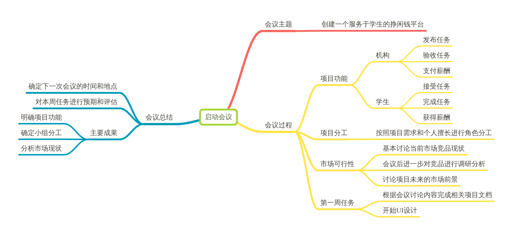

## Inception meeting
### Time : 2019/3/10
**会议目标**
- 确定项目的主题和名称，讨论主要功能和技术
- 进行团队组建和小组分工，明确每个人负责的工作和任务
- 讨论项目产品的市场可行性，对当前的市场上的类似产品进行竞品分析
- 说明第一周的工作任务和预期完成的项目进度
- 在github上创建组织和项目工程

**会议结果**
- 项目的名称、功能和技术

    我们选择了挣闲钱的项目，确定项目的中文名为盈小钱，英文名为Fat Wallet。主要实现要求中的三个功能，包括问卷调查、招新通知和取快递。服务对象包括发布任务的机构和接受任务的学生。我们初步打算做成web页面形式，先在PC端做出来再考虑移动端。

- 团队组建和分工

    主要分工包括项目经理，UI设计师，前端js工程师，后端python工程师等。具体分工见项目文档。

- 市场可行性

    我们通过讨论得出这样的结论：当前市场上存在少量类似的产品，但是大部分产品都存在功能不全或者没有市场的问题。也有一些大型的软件有很好的市场，但是服务对象和我们的项目有区别。总的来说，该项目有很好的市场前景，可以解决当今社会上存在的问题。

- 第一周的任务

    我们初步确定第一周的任务为完成项目分工、市场调研和竞品分析和启动会议等文档。然后开始UI设计，重点是确定界面的风格和形式。预期可以完成上述文档以及部分的界面设计。

**思维导图**
 