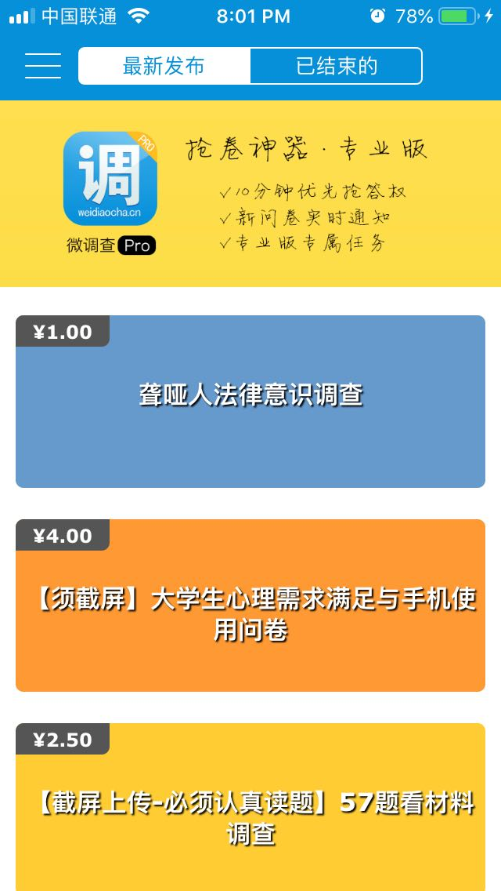
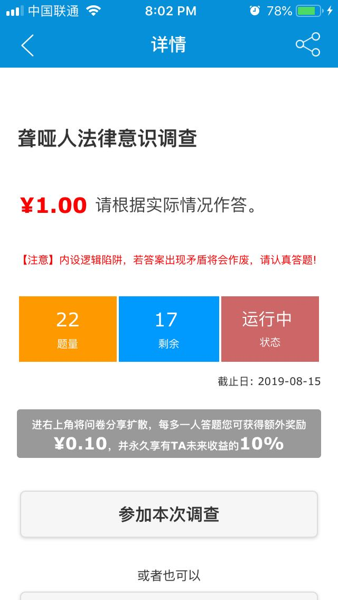

# 前期调研和竞品分析报告
## 1. 前期调研
**项目背景**

如今的社会是互联网的社会，任何领域和事务都无法离开网络。特别是在电商兴起之后，大量的交易在线上进行，人们往往宁愿刷某宝也不想去实体店。另外大众的饮食习惯也在改变，饿了么、美团等外卖软件让我们足不出户就可以享受美食。这些变化都是顺应时代的潮流，都是不可避免的。每个人都希望这个社会可以更加便利，这样才可以把更多的精力投入到事业中去。在这样的背景之下，我们团队以服务大众，让生活更加简单为目标，希望开发一个线上交易平台，其主要功能是为学生提供做任务赚闲钱的机会，让他们在学习之余也可以有经济来源。

**市场现状**

虽说现在市场上的交易平台有很多，但是大多都是物品交易，例如淘宝、京东等。这些平台作为中介，促成交易双方的物品和金钱交易，通过收取网店租金和广告费来获利。这显然无法满足学生通过完成任务获利的需求。另外一类平台，例如猎聘网、斗米网等，这些招聘和兼职网站为学生提供赚钱的机会，但是是以提供工作的方式。参加工作意味着要花费大量的时间和精力，这不适用于还在学习阶段的大学生。总的来说，现在市场上服务于学生的赚钱网站少之又少，因此开发一个新的平台，为学生提供赚闲钱的机会是很有必要的。

**目标人群**

该平台主要针对于两类人群，首先是发布任务的机构，这些机构可以在平台上发布任务，在学生完成任务后再审核确定，即完成交易。另外一类人群是接受任务的大学生，学生接受任务并完成即可领取赏金。当然，二者并没有清晰的界线，例如学生也可以作为机构在平台上发布任务。

## 2. 竞品分析
**竞品概况**

当前通过发布任务为学生提供赚钱机会的平台不多，大多数交易平台都是物品交易。故常规电商平台不在我们的竞品范围之内。在调研过程中，我们发现的确存在和我们软件功能类似的平台，但在使用过程中会碰到各种各样的问题，有的软件甚至无法通过手机注册，如唐三赚APP。这些充满bug的软件显然无法在学生群体中普及。除此之外，我们还调查了其他软件，下面详细介绍其中三项：被实Online公众号、一品威客、微调查APP。

**被实Online公众号**

- 简介：被试Online是一个发布招募信息的平台，主要提供一些实验室的招募信息，学生可以通过完成这些实验赚钱。虽然这只是中大的一个公众号，但是我认为其功能和我们的设计需求非常类似，所以也在调研范围之内。
- 目标人群：中大学生
- 产品种类：微信公众号
- 优势和特点：以公众号的形式发布任务，对于学生来说非常方便，学生可以快捷地浏览当前的实验并选择合适的报名。另外几乎不需要维护成本，管理公众号非常简单，只需要发布任务和实验。
- 缺点和问题：最重要的问题是服务范围窄，毕竟只适用于中大的学生，外校的学生无法了解该公众号，无法参与到实验中。此外还有无法盈利的问题，该公众号本质是学校内部的服务公众号，关注量不大，也无法投放广告。
- 界面截图：

<table>
    <tr>
        <td ></td>
        <td ></td>
        <td ></td>
        <td ></td>
    </tr>
</table>

**一品威客**

- 简介：一品威客是一个提供服务交易的电子商务平台，是一个通过互联网解决科学、技术、生活、学习问题的交流平台，是中国新兴的威客模式的创意产品买卖平台，也是国内新型威客网站领先品牌。一品威客拥有大量用户，用户可以通过该平台来完成金钱和服务的交易。
- 目标人群：社会群体
- 产品种类：电商平台
- 优势和特点：一品威客是一个大型正规的电商平台，有完整的运营模式和组织体系，还有用庞大的用户群体，日交易量也非常可观。可以说这是一个非常成熟的交易平台。
- 劣势和问题：该平台和我们软件的主要区别在于面向的群体不同，我很难在一品威客上找到一些适合学生的简单轻松的小任务，大多任务都是软件设计、APP开发等。这些任务对于在读的大学生来说难度太大且要花费很多的精力。
- 界面截图：

<table>
    <tr>
        <td ></td>
    </tr>
    <tr>
        <td ></td>
    </tr>
    <tr>
        <td ></td>
    </tr>
</table>

**微调查APP**

- 简介：微调查APP是一款基于有奖调查的手机软件，用户主要通过完成调查问卷的方式赚钱。用户可以在平台上发布调查问卷和通过完成调查问卷赚钱。
- 目标人群：社会群体
- 产品种类：APP
- 优势和特点：使用非常方便，用户可以通过微信登陆，然后绑定支付宝就可以进行交易。任务的形式和操作都非常简单，只需要完成调查问卷就可以获得赏金，且不需要大量时间，非常适合学生使用。
- 劣势和问题：微调查APP的任务形式非常单一，只有调查问卷这一种任务。这极大限制了用户数量，严重影响用户的使用感受，当学生希望以其他的形式获得赏金时，这款APP显然无法满足大众需求。
- 界面截图：

<table>
    <tr>
        <td ></td>
        <td ></td>
        <td ></td>
        <td ></td>
    </tr>
</table>

## 3. 总结
在进行竞品分析之前我们调查过很多同学，询问他们有是否知道一些通过做任务赚闲钱的平台或中介。让我们惊讶的是几乎没有人了解。这个现象反映了一大问题，即当前并不存在此类功能的软件。这样说或许过于绝对，但可以保证的是，即使软件存在，也没有在学生群体中普及。学生们知道的都是淘宝之类的电商平台。

综上所述，我们认为盈小钱平台有非常好的实用性和拓展性，主要针对在校大学生群体和私营机构，受众非常广，可以很好地帮助学生在学习之余赚取外快。当前市面上竞争产品比较少，因此有很好的市场。产品成型之后关键在于拓展市场，从中大开始，逐渐发展到各个高校，相信盈小钱可以发展成中国数一数二的服务型交易网站。