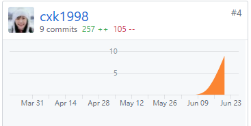

# 16340014-cxk1998 Final Report

## 1.个人简短小结

这个项目中我是团队产品经理，我主要负责写文档、画图、管理团队。

下面分项介绍我在项目完成的内容

#### 管理

- 调整开发节奏，保证大家每个月都有产出。
- 帮助前后台沟通

#### 分析

- 开会推敲细节实现。
- 参与分析并设计 

#### 设计

- 使用 Adobe XD 设计 UI 界面。
- 对项目进行整理设计(各类建模图)

## 2.PSP 2.1 统计

| **PSP 各个阶段**                                             | 时间(min) |
| ------------------------------------------------------------ | --------- |
| **计划:** 明确需求和其他因素，估计以下的各个任务需要多少时间 | 120       |
| **开发** （包括下面 8 项子任务）                             |           |
| 需求分析 (包括学习新技术、新工具的时间)                      | 150       |
| 生成设计文档 （整体框架的设计，各模块的接口，用时序图，快速原型等方法） | 120       |
| 设计复审 (和同事审核设计文档，或者自己复审)                  | 120       |
| 代码规范 (为目前的开发制定或选择合适的规范)                  | 60        |
| 具体设计（用伪代码，流程图等方法来设计具体模块）             | 120       |
| 具体编码                                                     | 300       |
| 代码复审                                                     | 120       |
| 测试（自我测试，修改代码，提交修改）                         | 180       |
| **报告**                                                     |           |
| 测试报告（发现了多少bug，修复了多少）                        | 60        |
| 计算工作量 (多少行代码，多少次签入，多少测试用例，其他工作量) | 60        |
| 事后总结, 并提出改进计划 （包括写文档、博客的时间）          | 120       |

## 3.主要工作清单

### 3.1记录最得意/或有价值/或有苦劳的工作清单

**最得意**：分析需求和设计UI。像是发布任务界面，个人信息界面都有参与设计。

 **最有价值**：和其他的PM以及开发小组一起开会研讨，我们开会的秩序比较好，有次序，先讨论设计，再讨论前后端，同时只有一个人在发言，很有条理。

### 3.2在项目相关仓库中的贡献，仅需要截图

### 3.3个人博客清单

[Adobe的UI设计学习](https://blog.csdn.net/che16340014/article/details/94184943)

### 3.4特别致谢

陈帆同学，他在后台积极的完成任务，对于PM协调团队工作也帮助了很多，交代自己实现的部分时也很清楚，使我们写文档很方便。

当然，其实每个开发的同学都应该感谢，毕竟这个项目是大家的努力，很开心能一同开发。

