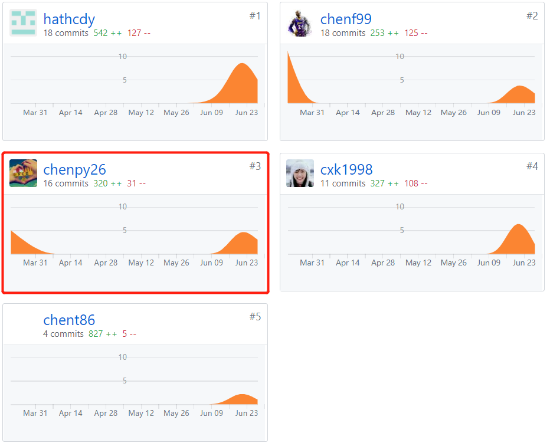

# 个人报告

### 自我总结
作为团队中的项目经理，我的主要任务是管理团队、确定功能需求、编写文档以及完成大部分的UI设计。这是我第一次担任一个开发团队的项目经理，原本以为不写代码比较轻松，但实际上有非常多的工作。我需要为组员分配任务并监督他们按时完成任务，对于一些文档，例如前景调查和竞品分析，我都是认真调查并完成文档编写。另外我的大部分时间都花在UI设计上，我确定了项目的主题风格，并完成了所有主界面的UI设计。总的来说，我对团队有很大的贡献，我对自己的工作也比较满意。
下面是我的部分工作成果：

#### 文档
- 完成前期部分文档的编写，包括：
    - [项目概况](../docs/about.md)
    - [团队组建与分工](../docs/team-profile.md)
    - [项目前期调研/竞品分析](../docs/investigation.md)
    - [项目愿景](../docs/vision.md)
    - [产品特性库](../docs/product_backlog.md)
- 完成UI设计和用户使用手册文档：
    - [UI设计](../require_spec/UIDesign.md)
    - [用户手册](../require_spec/用户手册.md)

#### 管理
- 早期分配工作和任务，使团队可以尽快开始开发任务。
- 定期组织会议，讨论上周的任务完成情况和这周的预期任务进展。

#### 设计
- 使用Adobe XD进行UI设计，具体设计见[UI设计](../require_spec/UIDesign.md)。

### PSP2.1表格
|             | **Personal Software Process Stages** | time(%) |
| :---------: | :----------------------------------: | :-----: |
| **Planning**|               **计划**               |   20%   |
|             |              制定项目计划             |   16%    |
|             |               预估时间                |   4%    |
|**Development**|             **开发**               |   50%   |
|             |               需求分析                |   12%   |
|             |               功能设计                |   8%   |
|             |               UI设计                 |   24%   |
|             |               代码规范               |   2%    |
|             |               代码审查               |   2%    |
|             |               测试代码               |   2%    |
| **Report**  |             **编写文档**             |   30%   |
|             |             完成项目前期文档          |   22%   |
|             |               其他文档               |   8%    |

### 最得意/或有价值/或有苦劳的工作清单
- 最得意：需求功能分析和UI设计，我提出了项目大部分的功能设计，并在此基础上设计了项目界面，整个UI的排版和风格都比较符合我们的项目主题，对于整个界面效果符合我的预期。
- 最有价值：我认为文档对于一个项目是最有价值的，通过文档可以看到项目的主题、设计和功能等。所以我认为我完成的部分文档编写是非常有价值的。此外，我对于团队的管理和协调也是有价值的。

### 项目贡献

### 特别致谢
我要感谢所有的组员，每个人都为了项目的开发投入了太多的时间和精力，没有大家共同的努力是无法完成整个项目的。
