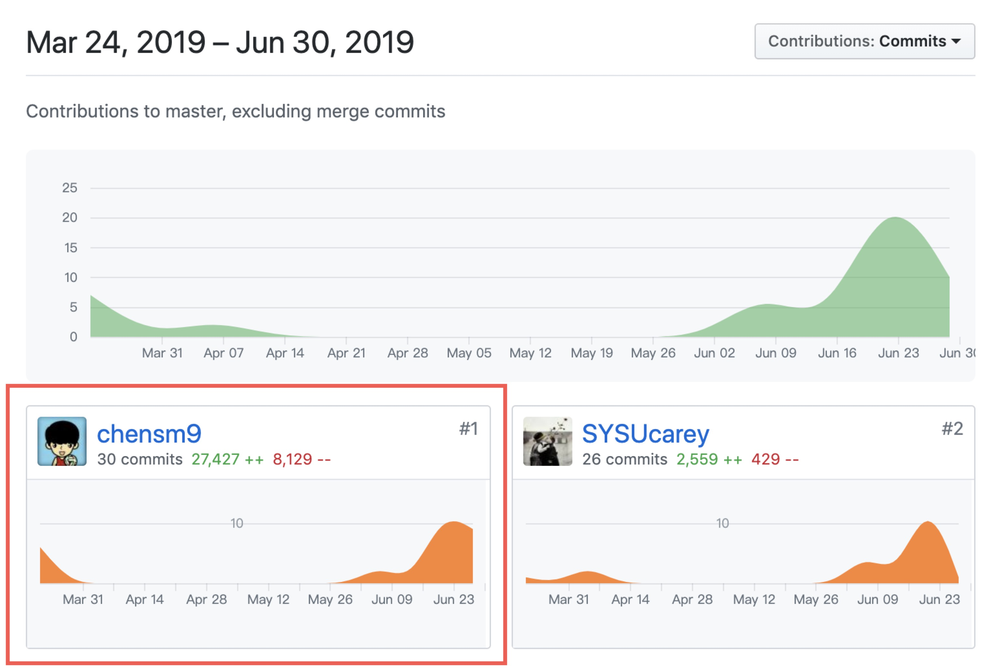

# 个人报告

## 16340030 陈斯敏

### 简短的课程学习自我总结

在此次的项目开发中，我主要负责前端页面代码实现，以及与后端的联调工作，学习了一下 vue 的相关知识，根据 PM 设计的相应界面图，实现相应的界面布局和功能。

### PSP 2.1 统计表

 
PSP2.1       | Personal Software Process Stages| Time (%) Senior Student |
------------ | ------------------------------- | ----------------------- |
**Planning** | **计划** | 5 |
Estimate  | 估计这个任务需要多少时间 | 5 |
**Development**  | **开发** |  80 |
Analysis   | 需求分析 (包括学习新技术) | 20 |
Design Spec| 生成设计文档 | 6 |
Design Review| 设计复审 (和同事审核设计文档)| 5 |
Coding Standard| 代码规范 (为目前的开发制定合适的规范)| 5 |
Design|具体设计| 10 |
Coding|具体编码| 40 |
Code Review| 代码复审| 4 |
Test|测试（自我测试，修改代码，提交修改）| 10 |
**Reporting** | **报告** | 10 |
Test Report | 测试报告 | 0 |
Size Measurement | 计算工作量 | 2 |
Postmortem & Process Improvement Plan| 事后总结, 并提出过程改进计划 | 8 |

### GIT 统计报告

### 自认为最得意/或有价值/或有苦劳的工作清单，含简短说明

学习 vue 使用，尝试使用 vuex 存储部分信息，引入 localStorage 做数据的缓存处理，使用 axios 作为数据获取 request 的实现和与后端的 api 对接。

### 个人的技术类、项目管理类博客清单

  - [Vue 实战相关](https://blog.csdn.net/csm201314/article/details/94356808)