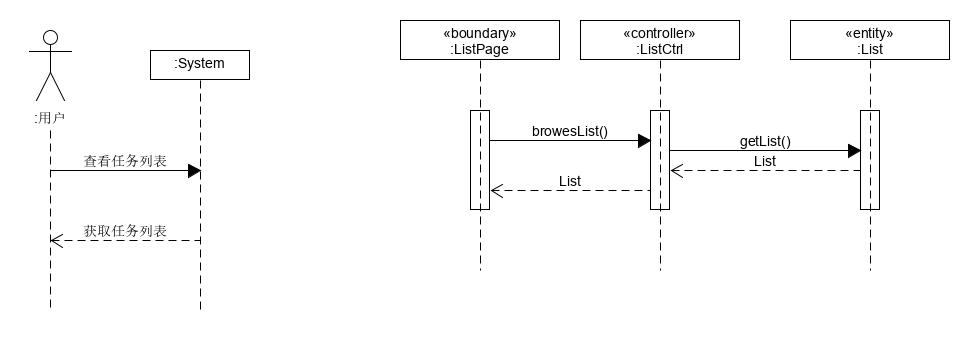
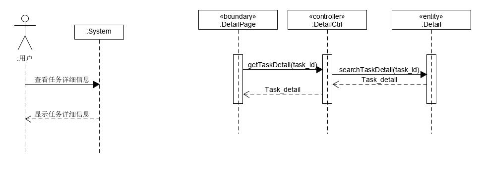
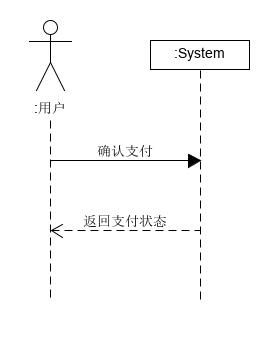
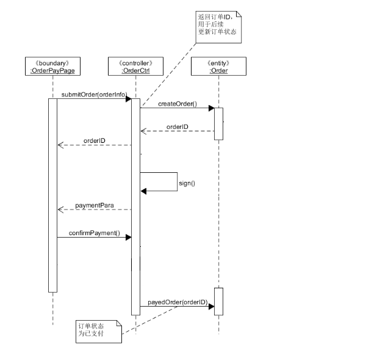

# System Sequence Diagram （功能模型）

根据我们的[用例分析](https://github.com/haowe-7/Dashboard/blob/master/require_spec/UseCases.md)

## 基本功能

1. 浏览任务列表

3. 任务详细信息

4. 支付酬金

用户可以获取任务列表，浏览任务的详细信息，选择接取任务，支付酬金

## 系统顺序图

### 1. 浏览任务列表

用户进入主菜单页面浏览任务列表

### 2. 获取任务详细信息

用户获取某个任务的详细信息

### 3.支付酬金

