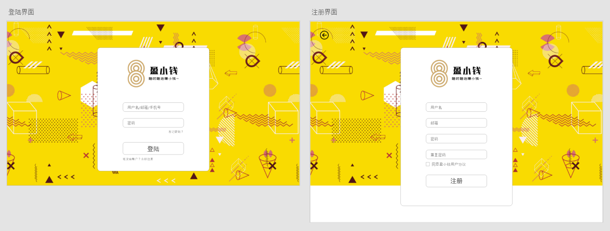
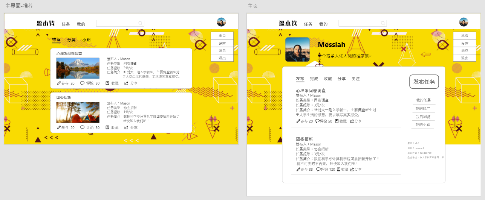
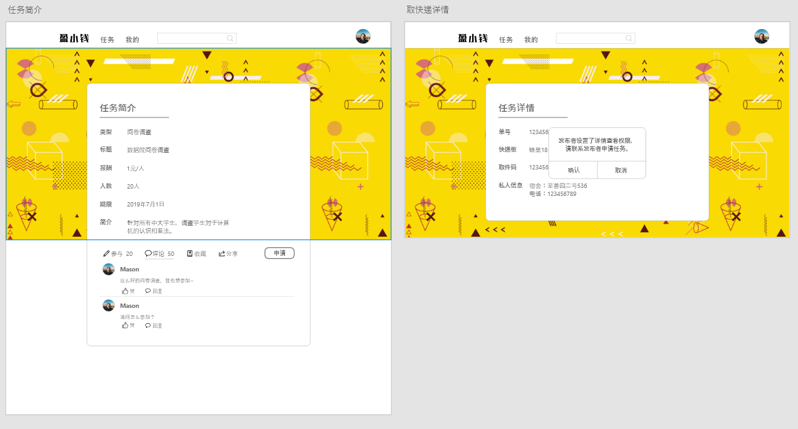
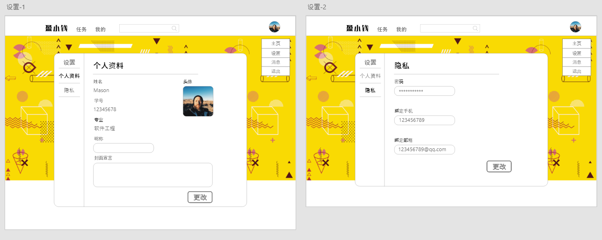

# UI design
### 1. 登陆注册界面

盈小钱的logo是我们自主设计，整个界面以黄色图片作为背景，输入框无背景。图片来源：https://ibaotu.com/sucai/1014951.html。登陆和注册界面大概占屏幕宽度的1/3。最初版的注册界面包括用户的姓名、学号等详细信息，后来在迭代过程中修改UI，只保留用户名、邮箱和密码，保证界面更加简洁，没有冗余。

### 2. 主界面

主界面包括任务界面和我的界面，通过顶部导航栏进行界面切换。任务界面是一个List，列举了当前所有的任务，每个任务是一个卡片，卡片之间保留间隔。在我的界面可以查看和用户相关的所有任务，用户可以在此选择发布任务和查看自己的所有任务。整个界面设计参考了知乎网页版，主要包括卡片内部排版和分类列表的设计。

### 3. 任务详情界面

点击任务列表的任务进入可查看任务的详情和相关评论，这里的所有信息不包括用户隐私，例如取快递业务中的单号和密码等。用户根据可见信息选择是否接受任务，当确定申请任务后才有权查看隐私信息。发布任务方可设置接收方是否需要权限申请，如果需要弹出申请要求。对于没有隐私信息的任务类型来说可直接申请成功。

### 4. 发布任务界面

在我的界面可发布任务，用户需要填写所有人可见的基本信息，还有需要申请才可查看的隐私信息。故我们把发布任务分为简介和详情两个部分。对于没有隐私信息的任务来说，直接填写基本信息即可发布任务。

### 5. 设置界面

我们在设置界面左侧添加导航栏，目前主要包括个人资料和隐私两个部分，在以后的迭代中会根据需求添加。用户在注册界面主要填写了隐私信息，注册成功后还要完善个人资料，如果不完成实名认证则无法发布和接受任务。初步UI设计是把所有信息放在一起，但是界面会显得特别拥挤，所以在讨论后决定分成两个部分，这样更加美观。