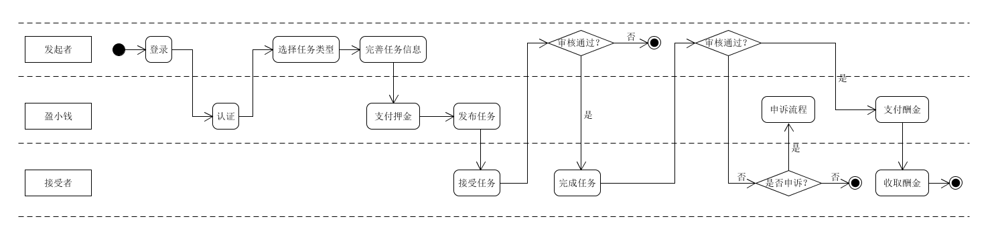

# Use Cases 用例+活动图

## 1.业务活动图

## 2.发布任务用例描述

### 主成功场景

发布者登录系统，点击发布任务，选择任务类型，根据提示完善任务信息，提交任务，支付押金后，完成发布。

### 交替场景

- 发布者提交完任务后要修改任务信息，点击返回填写页面。

## 3.接受任务用例描述

### 主成功场景

接受者登录系统，选择任务，点击接受任务，由任务发布者进行审核，审核通过后成为参与者，参与者完成任务后，提交任务完成情况，由任务发布者进行审核，审核通过后发布者向接受者支付酬金。

### 交替场景

- 接受任务的审核不通过，任务接受者无法成为参与者。

- 任务完成情况的审核不通过，不予支付酬金，接受者可选择向平台发起申诉。