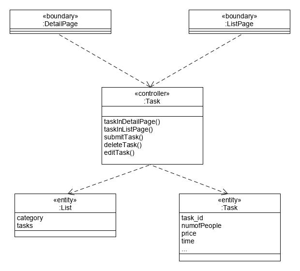

| 版本 | 日期       | 描述            | 作者    |
| ---- | ---------- | --------------- | ------- |
| V1.0 | 2019-06-27 | Use Case Design | cxk1998 |

- 任务搜索
  - 任务简介
- 获取任务详情
  - 任务点赞
  - 任务评论
  - 加入任务
  - 退出任务
- 用户信息管理
  - 获取相对应列表
  - 用户信息修改

## Usecase

在主页中，用户根据不同的类型获取任务列表。

点击列表项目进入详情页。

根据用户点击时的任务id，可以获取对应的任务详情。

用户可以选择加入任务。

用户完成任务后获得相应报酬。

## User

### Task

