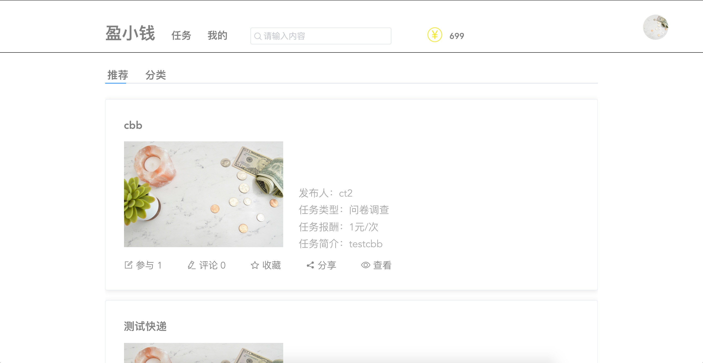
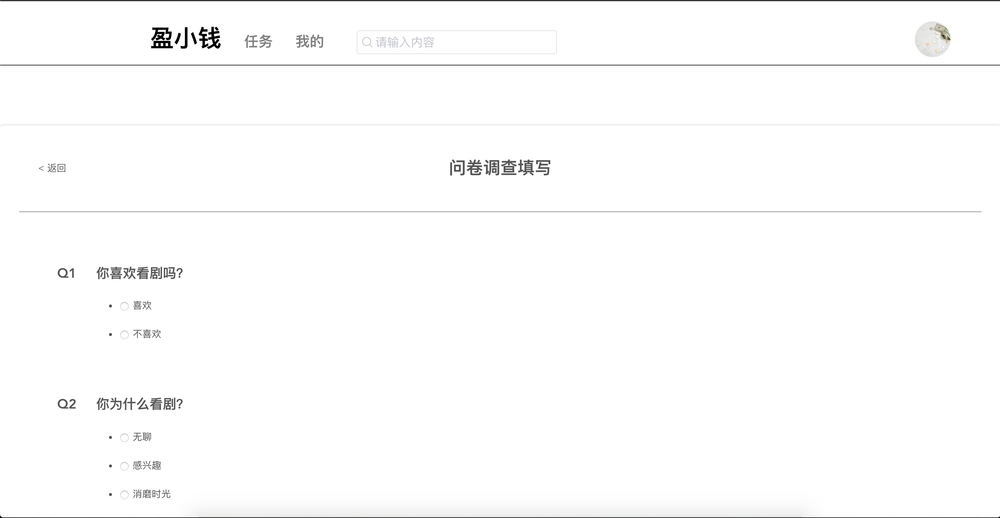

# 用户手册

1. 用户在使用盈小钱之前需要进行注册和登陆，注册需要用户名、邮箱和密码，登陆后可在设置界面完善其他信息。

2. 登陆后进入主界面，主界面包括任务界面和我的界面。任务界面显示当前所有的任务，用户点击任务可以查看详情。

3. 在详情界面用户可以选择是否申请任务，申请之后需要发布者的同意才可以查看任务详情并完成任务，在完成任务后提交任务获得酬金。

4. 在我的界面可以看到与用户相关的所有任务，用户可以点击发布按钮发布任务。

5. 发布任务首先要填写任务的基本信息，对于问卷调查任务可编辑问卷格式，对于取快递任务需要填写私人信息。

6. 用户可以在设置界面对私人信息进行编辑。

